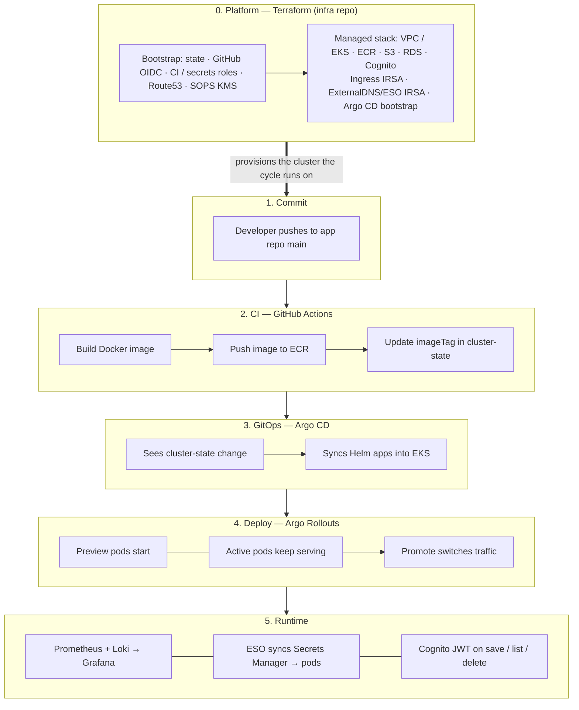
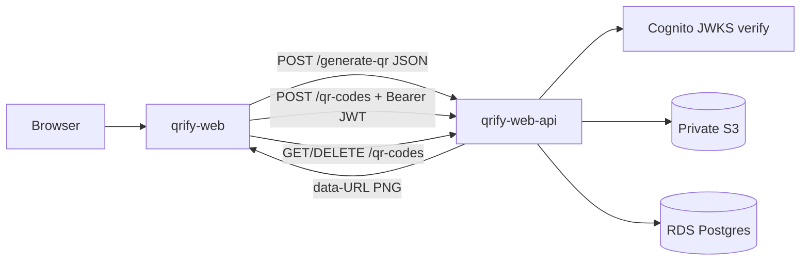
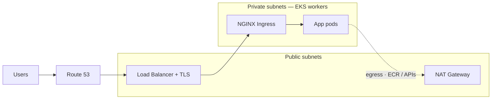

# QRify Platform

Welcome to the GitHub organization for the **QRify Platform** — a hands-on project that models a **production-style delivery plane on Amazon EKS**. The sample product is a small QR code app (web + API); the focus is the surrounding stack: Terraform + OIDC CI, GitOps, progressive delivery, secrets, observability, Cognito auth, and an internal developer portal for service scaffolding.

**Live hosts**

| Env | Product | Portal |
|-----|---------|--------|
| **prod** | [qrify-web.com](https://qrify-web.com) | [portal.qrify-web.com](https://portal.qrify-web.com) |
| **dev** | [dev.qrify-web.com](https://dev.qrify-web.com) | [portal-dev.qrify-web.com](https://portal-dev.qrify-web.com) |

API traffic is served under `/backend` on the web hosts.

---

## Architecture overview

| Piece | Role |
|-------|------|
| **Frontend (`qrify-web`)** | Next.js UI — multi-type QR generate, Cognito sign-in, optional **Save to My codes**, delete |
| **API (`qrify-web-api`)** | FastAPI — preview (data-URL, no persist) vs save (S3 + Postgres), JWT auth, rate limits |
| **Developer portal (`qrify-portal`)** | Scaffolds a new service: GitHub repo, ECR, GitOps entries in `cluster-state` |
| **Secrets (`secrets-manager`)** | SOPS → AWS Secrets Manager; **External Secrets Operator** syncs into the cluster |
| **GitOps (`cluster-state`)** | Argo CD App of Apps + per-service Helm values for `dev` / `prod` + platform add-ons |
| **Shared charts (`helm-charts`)** | `qrify-base` (deploy/rollout/HPA/ingress) and `qrify-secrets` (ExternalSecret) |
| **CI composites (`github-actions`)** | OIDC assume-role, Docker→ECR, `update-app-tag`, ECR retag, EKS helpers |

Workloads run on **Amazon EKS** (`us-east-2`). Delivery is **GitOps via Argo CD**. Progressive delivery uses **Argo Rollouts** (blue/green). Observability is **Prometheus + Grafana + Loki**. Edge traffic hits **NGINX Ingress** with **ACM** TLS and **Route 53** / **ExternalDNS**. Identity is **Amazon Cognito** (per-env pools). App images land in private **S3**; durable metadata lives in **RDS Postgres**.

### How the platform works



Terraform stands up the platform **once** (and when infra changes). Shipping a feature does **not** re-run Terraform — it goes through the app cycle on top.

0. **Terraform** — bootstrap foundation + managed EKS/data/auth plane  
1. **Push** code to the app repo  
2. **CI** builds/pushes an ECR image and bumps `imageTag` in `cluster-state`  
3. **Argo CD** syncs that Git change into EKS  
4. **Argo Rollouts** runs blue/green (preview first; prod Promote is often a human gate)  
5. **Runtime** — metrics/logs, secrets via ESO, Cognito for owned QR codes  

### Product request path (system design)



- **Generate** — public, rate-limited, returns a PNG data-URL; **does not** write S3/DB  
- **Save** — Cognito JWT required; PNG → S3, row → Postgres (`user_id` = Cognito `sub`)  
- **My codes** — list + delete owned rows; downloads use short-lived S3 presigned URLs  

### Networking

Public edge in front, private workers behind.



**Inbound:** Users → DNS → LB (TLS) → Ingress → pods  
**Outbound:** pods → NAT → internet (plus S3 gateway endpoint on private route tables)

---

## Technologies

* **Next.js** — Product UI and developer portal  
* **FastAPI** — Backend API (preview / save / list / delete)  
* **Docker** — All app images  
* **Kubernetes (EKS)** — Orchestration (`dev` / `prod` namespaces)  
* **Argo CD** — GitOps (root → app-of-apps → child apps)  
* **Argo Rollouts** — Blue/green progressive delivery  
* **Helm** — `qrify-base` + `qrify-secrets` + per-env values  
* **GitHub Actions** — CI, image publish, GitOps tag bumps, portal scaffolding  
* **Terraform** — Bootstrap + managed AWS/K8s control plane  
* **AWS**
  * **EKS** — Workloads  
  * **ECR** — Per-service `*-dev` / `*-prod` images  
  * **S3** — Private QR PNG storage (presigned GET)  
  * **RDS Postgres** — Durable `id ↔ s3_key ↔ user_id`  
  * **Cognito** — Per-env user pools (email/password + Google)  
  * **Secrets Manager** — DB URL, Cognito config, Google OAuth, portal tokens  
  * **Route 53 + ACM** — DNS and TLS  
  * **IAM + OIDC** — CI roles + IRSA (API→S3, ESO, ExternalDNS)  
* **External Secrets Operator** — SM → Kubernetes Secrets  
* **ExternalDNS** — Ingress hosts → Route 53  
* **NGINX Ingress** — Cluster edge  
* **Prometheus / Grafana / Loki** — Metrics, dashboards, logs  
* **SOPS + KMS** — Encrypt secrets in the `secrets-manager` repo before apply  

---

## Repository overview

| Repository | Description |
|------------|-------------|
| [`qrify-web`](https://github.com/QRify-platform/qrify-web) | Next.js QR frontend · Cognito UI · Release → ECR → cluster-state |
| [`qrify-web-api`](https://github.com/QRify-platform/qrify-web-api) | FastAPI · Cognito JWT · S3 + Postgres · rate limits |
| [`qrify-portal`](https://github.com/QRify-platform/qrify-portal) | Internal developer portal · `scaffold-service` workflow |
| [`infra`](https://github.com/QRify-platform/infra) | Terraform bootstrap + EKS / RDS / Cognito / IRSA / ingress |
| [`cluster-state`](https://github.com/QRify-platform/cluster-state) | Argo CD App of Apps · app + apps-infra Helm values |
| [`helm-charts`](https://github.com/QRify-platform/helm-charts) | Shared `qrify-base` + `qrify-secrets` (GitHub Pages) |
| [`github-actions`](https://github.com/QRify-platform/github-actions) | Reusable composite actions (OIDC, build-push, tag update, …) |
| [`secrets-manager`](https://github.com/QRify-platform/secrets-manager) | SOPS → Secrets Manager (survives cluster teardown) |
| [`.github`](https://github.com/QRify-platform/.github) | This organization profile README |

---

## Environments

Separate **`dev`** and **`prod`** namespaces, each with Helm values (`values.dev.yaml` / `values.prod.yaml`):

- **Development** — Release on push to `main`; faster iteration; `dev.qrify-web.com`  
- **Production** — Promote via controlled workflow / Rollouts Promote; GitHub Environment reviewers; `qrify-web.com`  

Cognito pools, Secrets Manager paths, and GitOps values are **per environment**.

---

## Developer portal & service scaffolding

The **portal** is how new services join the platform:

1. Engineer submits a name + stack (`nodejs` or `python`) in the portal UI  
2. Portal dispatches `scaffold-service` on GitHub Actions  
3. Workflow creates the app repo from a template, ECR repos (`{name}-dev` / `{name}-prod`), and GitOps Helm entries in `cluster-state`  
4. First push runs **Release** → image build → `update-app-tag` → Argo sync  

Heavy permissions stay on Actions; the running portal only needs enough rights to dispatch. Frame this as **platform as a product for other engineers**.

---

## Progressive delivery (Argo Rollouts)

Releases use **Argo Rollouts** blue/green:

* Preview pods start while Active keeps serving  
* Prod often keeps **`autoPromotionEnabled: false`** so Promote is an explicit human gate  
* Failed probes support safe rollback  

Optional **HPA** (via `qrify-base`) scales on CPU where configured — useful pattern; node capacity is still a fixed EKS node group in this demo.

---

## Observability

* **Prometheus** — Scrapes cluster and app endpoints (`/metrics`, `/api/metrics`)  
* **Grafana** — Custom **QRify Platform** and **QRify Applications** dashboards  
* **Loki + Promtail** — Logs by namespace / pod / container  

Distributed tracing is a natural next step (OpenTelemetry); metrics + logs are what ships today.

---

## Security & cloud practices

- **GitHub OIDC → IAM roles** for Terraform, ECR push, EKS access, and secrets apply (no long-lived AWS keys in CI)  
- **IRSA** for API → S3 and for External Secrets / ExternalDNS  
- **Secrets Manager + ESO** — secret *values* are not stored in `cluster-state`; they survive `terraform destroy` of the cluster  
- **Cognito** — JWT verification via JWKS; ownership enforced on save/list/delete  
- **Private S3** + short-lived **presigned GET** URLs  
- **Private RDS** (node SG only)  
- TLS via **ACM** + DNS via **Route 53** / ExternalDNS  
- Simple **per-IP rate limits** on generate/save/delete (in-memory; Redis would share limits across replicas)

---

## CI/CD & GitOps flow

```
push (app repo main)
  → GitHub Actions (OIDC → QRifyECRPushRole)
  → docker build-push → ECR (tag = short SHA)
  → update-app-tag → cluster-state values.{env}.yaml
  → Argo CD sync → EKS namespace (dev|prod)
  → (prod) ecr-retag + promote / Rollouts Promote
```

- **Argo CD** watches `cluster-state` (root → app-of-apps → apps + apps-infra)  
- **helm-charts** publishes charts to GitHub Pages on push to `main`  
- **secrets-manager** applies SOPS ciphertext → Secrets Manager; ESO refreshes pods  
- Platform rebuild path lives under `infra` workflows (plan / apply / destroy / rebuild)

---

## Bootstrap vs managed Terraform

| | Bootstrap | Managed stack |
|---|-----------|---------------|
| **Job** | Trust, remote state, CI roles, DNS zone, SOPS KMS | EKS, networking, ECR, S3, RDS, Cognito, IRSA, ingress/Argo bootstrap |
| **Lifecycle** | Rarely changed; survives cluster teardown | Applied/destroyed for DR drills |
| **Who applies** | Manual in `bootstrap/` | GitHub Actions |

If everything lived in one state file, destroy would also delete state storage, OIDC trust, and the DNS zone — breaking CI and domain delegation.

---

## Summary

QRify is a practice ground for production-minded platform + backend engineering:

- Sample QR product (generate → optional save → My codes) on a shared Kubernetes path  
- Internal portal that onboards services end-to-end  
- GitOps delivery with Argo CD + shared Helm + blue/green Rollouts  
- OIDC-based CI to ECR / EKS / Terraform / secrets  
- Cognito identity, private S3 + RDS data plane, IRSA  
- Secrets Manager + External Secrets (not plaintext in GitOps)  
- Prometheus / Grafana / Loki observability  

Designed to be **demoable, explainable, and honest about tradeoffs** (what ships vs what you’d add next — e.g. Redis for shared rate limits, CloudFront, distributed traces).
