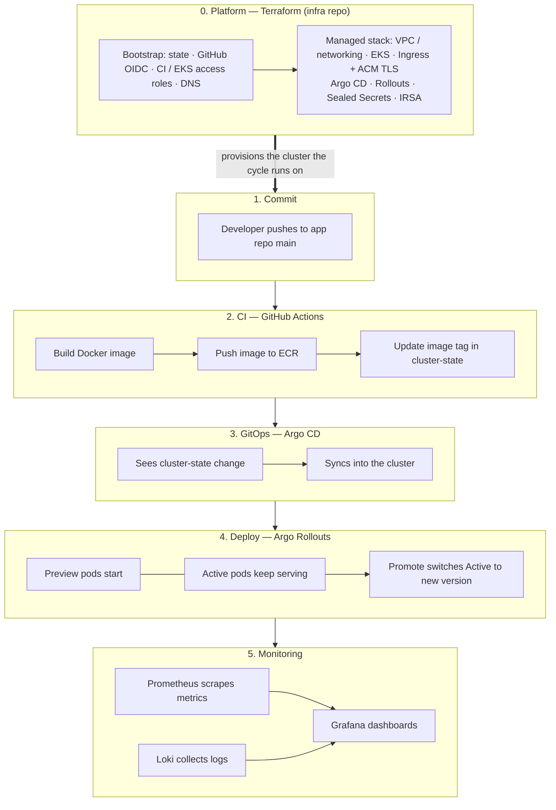
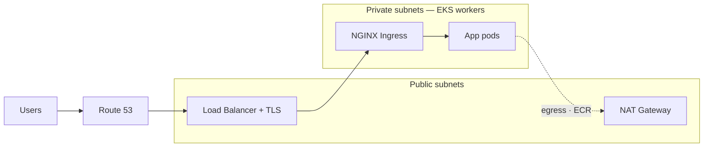

# 🚀 QRify Platform
Welcome to the GitHub organization for the QRify Platform — a project that models a production-style platform on Amazon EKS. The sample product is a small QR code app (web + API); the focus is the surrounding stack: GitOps, CI/OIDC, observability, secrets management, and an internal developer portal for service scaffolding.

**Live hosts**

| Env | Product | Portal |
|-----|---------|--------|
| **prod** | [qrify-web.com](https://qrify-web.com) | [portal.qrify-web.com](https://portal.qrify-web.com) |
| **dev** | [dev.qrify-web.com](https://dev.qrify-web.com) | [portal-dev.qrify-web.com](https://portal-dev.qrify-web.com) |

API traffic is served under `/backend` on the web hosts.

---

## 🧱 Architecture Overview

The platform is composed of product services and a supporting delivery plane:

- **Frontend (`qrify-web`)**: Next.js UI for submitting URLs and viewing QR codes
- **API (`qrify-web-api`)**: FastAPI service that generates QR codes and uploads them to **Amazon S3** (via **IRSA**)
- **Developer portal (`qrify-portal`)**: Internal Next.js portal that dispatches a scaffold workflow to create a new service repo, ECR repositories, and GitOps entries in `cluster-state`
- **Secrets (`sealed-secrets`)**: Encrypted Kubernetes secrets committed to Git and decrypted in-cluster by the Sealed Secrets controller
- **GitOps (`cluster-state`)**: Argo CD **App of Apps** + per-service Helm values for `dev` / `prod`
- **Shared chart (`helm-charts`)**: `qrify-base` Helm chart consumed by every app
- **CI composites (`github-actions`)**: Reusable Actions (OIDC assume-role, Docker→ECR, `update-app-tag`, EKS kubeconfig, etc.)

Workloads run on **Amazon EKS** (`qrify-eks`, `us-east-2`). Delivery is **GitOps via Argo CD**. Progressive delivery uses **Argo Rollouts**. Observability is **Prometheus + Grafana + Loki**. Edge traffic hits **NGINX Ingress** with **ACM** TLS and **Route 53** DNS. Infrastructure is **Terraform** (bootstrap for org OIDC/IAM + managed stack for the cluster and add-ons).

### How the platform works



Terraform stands up the platform **once** (and when infra changes). Shipping a feature does **not** re-run Terraform — it goes through the app cycle on top.

0. **Terraform** — VPC/networking, EKS, Ingress + ACM TLS, Argo CD/Rollouts, Sealed Secrets, IRSA, DNS/OIDC CI roles  
1. **Push** code to the app repo  
2. **CI** builds/pushes an ECR image and bumps the tag in `cluster-state`  
3. **Argo CD** syncs that Git change into EKS  
4. **Argo Rollouts** runs blue/green (preview first; prod Promote is often manual)  
5. **Monitoring** — Prometheus + Loki → Grafana  

### Networking

Public edge in front, private workers behind. Same layout in both AZs.



**Inbound:** Users → DNS → LB (TLS) → Ingress → pods *(all compute is private)*  
**Outbound:** pods → NAT → internet  

---

## 🔧 Technologies Used

* **Next.js** – Product UI and developer portal
* **FastAPI** – Backend API service
* **Docker** – Containerization for all apps
* **Kubernetes (EKS)** – Container orchestration
* **Argo CD** – GitOps continuous delivery (App of Apps)
* **Argo Rollouts** – Progressive delivery / safe promotions
* **Helm** – Shared `qrify-base` chart + per-env values
* **GitHub Actions** – CI, image publish, GitOps tag bumps, portal scaffolding
* **Terraform** – VPC, EKS, ECR, S3, IAM OIDC roles, ingress/DNS
* **AWS Services**
  * 🧠 **EKS** – Runs containerized workloads across `dev` / `prod` / platform namespaces
  * 📦 **S3** – Stores and serves generated QR images
  * 🌐 **Route 53** – DNS for `qrify-web.com` and env subdomains
  * 🔐 **IAM + OIDC** – GitHub→AWS roles (`QRifyTerraformRole`, `QRifyECRPushRole`, `QRifyEKSAccessRole`) and IRSA for the API
  * 📥 **ECR** – Per-service `*-dev` / `*-prod` images
  * 🔒 **ACM** – TLS certificates at the load balancer
* **Sealed Secrets** – GitOps-compatible secret encryption and delivery
* **NGINX Ingress** – Cluster ingress (NLB) for app traffic
* **Prometheus / Grafana / Loki** – Metrics, dashboards, and log aggregation

---

## 📁 Repository Overview

| Repository | Description |
|------------|-------------|
| [`qrify-web`](https://github.com/QRify-platform/qrify-web) | Next.js QR frontend · release workflows → ECR → cluster-state |
| [`qrify-web-api`](https://github.com/QRify-platform/qrify-web-api) | FastAPI QR API · S3 via IRSA |
| [`qrify-portal`](https://github.com/QRify-platform/qrify-portal) | Internal developer portal · `scaffold-service` workflow |
| [`infra`](https://github.com/QRify-platform/infra) | Terraform bootstrap + EKS / ECR / ingress / platform add-ons |
| [`cluster-state`](https://github.com/QRify-platform/cluster-state) | Argo CD App of Apps + Helm values for `dev` / `prod` |
| [`helm-charts`](https://github.com/QRify-platform/helm-charts) | Shared `qrify-base` chart (published to GitHub Pages) |
| [`github-actions`](https://github.com/QRify-platform/github-actions) | Reusable composite actions (OIDC, build-push, tag update, …) |
| [`sealed-secrets`](https://github.com/QRify-platform/sealed-secrets) | Encrypted SealedSecret manifests per environment |
| [`.github`](https://github.com/QRify-platform/.github) | This organization profile README |

---

## 🌐 Environments

QRify runs separate **`dev`** and **`prod`** namespaces, each with its own Helm values (`values.dev.yaml` / `values.prod.yaml`):

- **Development**
  - App release workflows run on push to `main`
  - Looser promotion settings for fast iteration
  - Hosts: `dev.qrify-web.com`, `portal-dev.qrify-web.com`

- **Production**
  - Typically promoted via `workflow_dispatch` / controlled rollouts
  - Stricter rollout settings
  - Hosts: `qrify-web.com`, `portal.qrify-web.com`

Environment configs stay in `cluster-state` and are synced independently by Argo CD.


---

## 🧭 Developer portal & service scaffolding

The **portal** is how new services join the platform:

1. Engineer submits a name + stack (`nodejs` or `python`) in the portal UI
2. Portal calls GitHub Actions `workflow_dispatch` on `qrify-portal` (thin PAT via Sealed Secret in-cluster)
3. `scaffold-service` creates a public app repo from a template, ECR repos (`{name}-dev` / `{name}-prod`), and GitOps Helm entries in `cluster-state`
4. First push to the new repo runs **Release Dev** → image build → `update-app-tag` → Argo sync

Heavy permissions (repo create, workflow files, ECR create) stay on the Actions secret; the running portal only needs enough rights to dispatch.

---

## 🔄 Progressive delivery (Argo Rollouts)

Releases use **Argo Rollouts** so new versions can be promoted safely with automated rollbacks when probes fail. Benefits include:

* **Controlled cutover** between revisions instead of blind rolling updates
* **Safe rollbacks** when health checks fail
* **Visibility** in Argo CD / Rollouts UIs before and after promotion


---

## 📈 Observability and Logging

* **Prometheus** – Collects metrics from Kubernetes workloads and application endpoints (`/api/metrics`, `/metrics`)
* **Grafana** – Dashboards for health, performance, and namespace-level insights
* **Loki + Promtail** – Centralized log aggregation labeled by namespace / pod / container

* **Custom Dashboards** – Built in Grafana to monitor:
  * Total logs per namespace
  * Error rates and top error messages
  * HTTP status code distribution (500s, 404s, etc.)
  * Top API endpoints and latency patterns (when duration is logged)

<p float="left">
  
  
</p>

---

## 🔒 Security & Cloud Best Practices

- **GitHub OIDC → IAM roles** for Terraform, ECR push, and EKS access (no long-lived AWS keys in CI)
- **IRSA** for API → S3 access without credentials in the pod
- **Sealed Secrets** for encrypted secret storage in Git (e.g. portal dispatch token), decrypted only in-cluster
- TLS via **ACM** + DNS via **Route 53**
- **NGINX Ingress** as the public edge for app hosts
- All infrastructure defined in Terraform modules

---

## ⚙️ CI/CD & GitOps flow

See the Mermaid diagram under **How the platform works** for the full cycle. In short:

```
push / dispatch (app repo)
  → GitHub Actions (OIDC → QRifyECRPushRole)
  → docker build-push → ECR (app-env:sha)
  → update-app-tag → cluster-state values.{env}.yaml
  → Argo CD sync → EKS ns (dev|prod)
```

- **Argo CD** watches `cluster-state` (root → app-of-apps → child apps)
- **helm-charts** publishes `qrify-base` to GitHub Pages on push to `main`
- **sealed-secrets** syncs encrypted manifests into `dev` / `prod`
- Platform rebuild path lives under `infra` workflows (plan / apply / rebuild)

---

## ✅ Summary

The QRify Platform is a hands-on demonstration of production-minded platform engineering:

- Product apps (QR web + API) on a shared Kubernetes path
- Internal portal that onboards new services end-to-end
- GitOps delivery with Argo CD + shared Helm
- OIDC-based CI to ECR / EKS / Terraform
- Encrypted secrets via Sealed Secrets
- Prometheus / Grafana / Loki observability
- Progressive delivery with Argo Rollouts

Designed for performance, security, and maintainability in modern cloud-native ecosystems.
